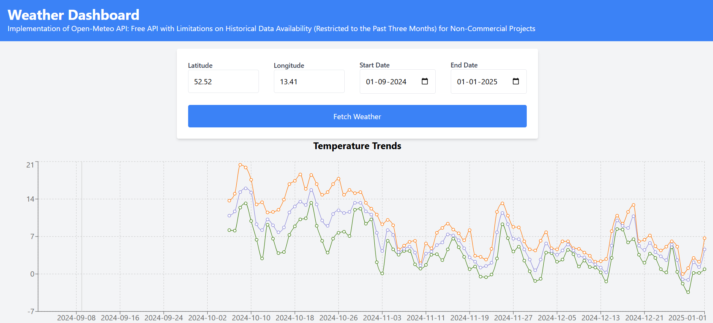
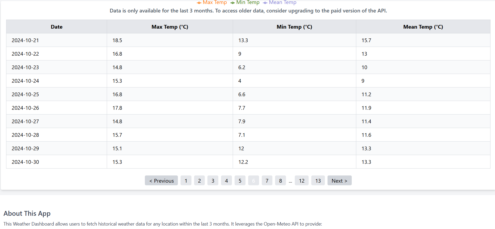

# Weather Data Fetcher 🌤️

## Project Description
Weather Data Fetcher is a web application that allows users to fetch weather data for a specific latitude and longitude. The app utilizes the [Open-Meteo API](https://open-meteo.com/) and provides weather data for a period of up to 3 months for free. Users can input geographic coordinates and select a date range to retrieve weather information.

## Live Site: 
[https://dashoard-weather.netlify.app/](https://dashoard-weather.netlify.app/)

## Screenshot



## Features
- Fetch weather data for any location using latitude and longitude.
- Supports a maximum of 3 months of weather data (per Open-Meteo API limitations).
- Ensures user inputs are validated (no future dates and a maximum range of 93 days).
- Responsive design for all devices.
- Built with **Next.js**, styled with **Tailwind CSS**.

## Libraries Used
- Next.js: React framework for server-side rendering and static site generation.
- React: JavaScript library for building user interfaces.
- Tailwind CSS: Utility-first CSS framework for styling.
- react-paginate: Component for easy implementation of pagination in React applications.
- recharts: Declarative charting library for building reusable and responsive charts in React.


## Getting Started
Prerequisites
Node.js
npm (or yarn)

# Installation
Clone the repository:
```bash
Copy code
git clone https://github.com/akdhiman358/portfolio_nextJs.git
```
Navigate to the project directory:
```bash
Copy code
cd portfolio
```
Install dependencies:
```bash
Copy code
npm install
```
or
```bash
Copy code
yarn install
```
Running the Development Server
```bash
Copy code
npm run dev
```
or

```bash
Copy code
yarn dev
```
Open http://localhost:3000 in your browser to see the result.

Building for Production
```bash
Copy code
npm run build
```
or

```bash
Copy code
yarn build
```
Running in Production Mode
After building the project, you can start it in production mode with:

```bash
Copy code
npm start
```
or

```bash
Copy code
yarn start
```
### Deploying
This project can be deployed to any static site hosting service. Netlify is used for the live version.

### Contributing
If you have suggestions for improvements or encounter any issues, feel free to open an issue or submit a pull request.

### Contact
For any inquiries, please reach out to me via akshayud0@gmail.com
